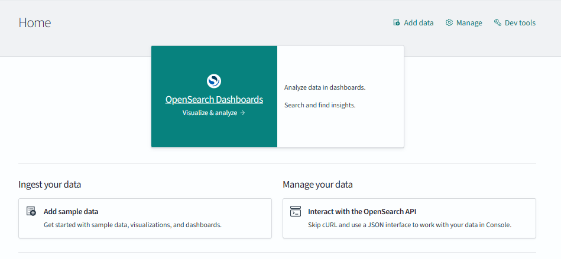
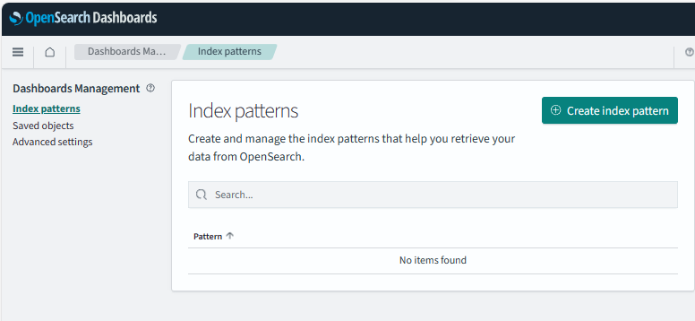
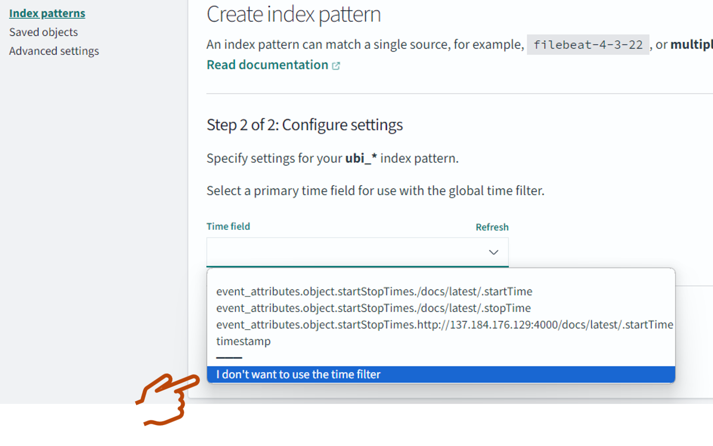
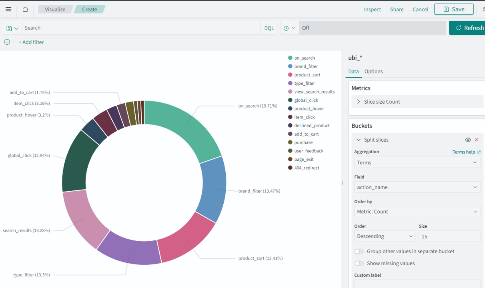
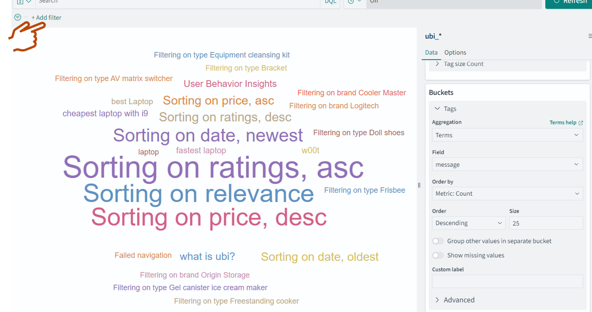
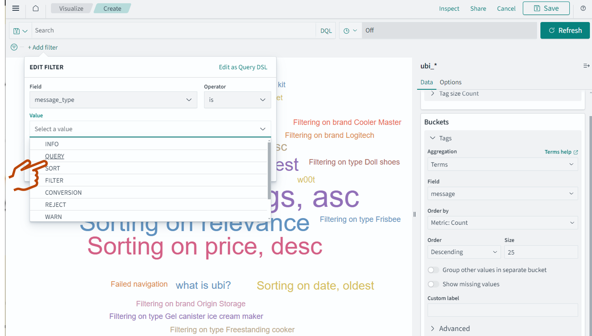

# Kata x: Build an analytic dashboard!
Whether you've been collecting user events and queries for a while, or [you uploaded some sample events](00X.a_import_UBI_data_events.md), now you're ready to visualize them in the dashboard!

## 1) Fire up the OpenSearch dashboards
Depending on your configuration: http://localhost:5601/app/home#/

## 2) Create an index pattern
http://localhost:5601/app/management/opensearch-dashboards/indexPatterns

After you click on "Create index pattern" you'll see a list of indices in your OpenSearch instance.  The UBI stores are hidden by default; so, be sure to click on "Include system and hidden indices".  

With wildcards you can group indices into the same data source for your dashboard.  Assuming the name of your UBI is `ubi_log`, we'll lump both the query and event stores together as `.ubi_log*`.

It will prompt you to filter on any `date` field in your schema, so that you can look at things like trending queries over the last 15 minutes, etc.  However, for your first dashboard, do not filter on any date field. 

 Click on "Create index pattern", and you're ready to start building your dashboard!

## 3) Create a new dasboard
http://localhost:5601/app/opensearch_dashboards_overview#/

The screen will bring up an empty dashboard, ready for your analytic widgets.
|Create new|Choose the pie chart visualization|
|---|---|
|||

Most of the visualization require some sort of aggregate function on an aggregatable field (i.e. numeric or keyword).  We'll add a `Terms` aggregation on the field `action_name`.  Change the size to the number of slices you want to display.

Save that visualization and it will be added to your new dashboard.  Now that you have a visualization on your dashboard, you can save your dashboard.

## 4) Add a "Tag Cloud" vizualization to your dashboard
Let's add a word cloud for trending searches.  Choose the Tag Cloud visualization of the terms in the `message` field where the javascript client logs the raw text that the user searches on.  (Note: the true query, as processed by OpenSearch with filters, boosting, etc. will be in the `.{store}_queries` index. )

But there's a problem!  The `message` field is on every event --not just query/search events-- and can be used in anyway the client developer decides to use it; so, it can contain error messages, debug messages, click information, etc.  
We need to add a filter.  Since the developer gave a `message_type` of `QUERY` for each search event, we will filter on that message type. 

